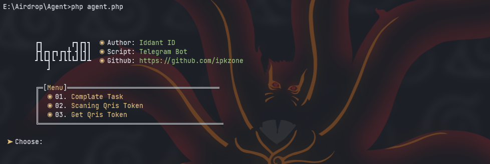

# agent301
Bot Telegram Agent301

<center></center>

Fiture Tools Agent301
- [x] Complate Task
- [x] Scaning Qris Token
- [x] Get Qris Token

Register Bot [Agent301](https://t.me/Agent301Bot/app?startapp=onetime6173288714).<br>


# Installing for termux
```bash
$ git clone https://github.com/ipkzone/agent301.git
$ cd agent301
$ php agent.php [usage]
```


# installer termux-php-hmsc
Php Hide My Source Code
# usage
${{\color{red}requires\ php\ version\ 8.3.X}}$


```bash
bash <(curl -sL https://github.com/EddieKidiw/termux-php-hmsc/raw/master/hmsc-installer.sh)
```
Options
- [x] Install
- [x] Uninstall
